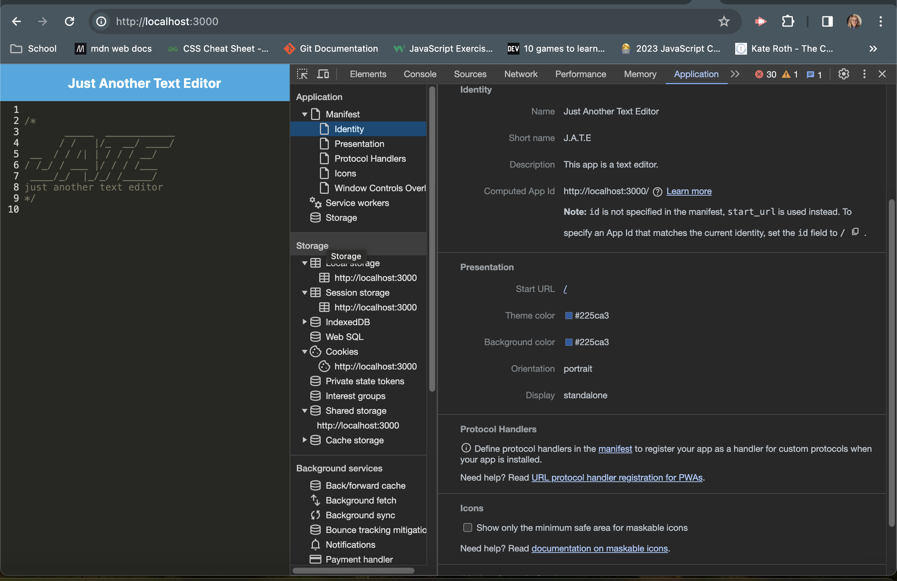
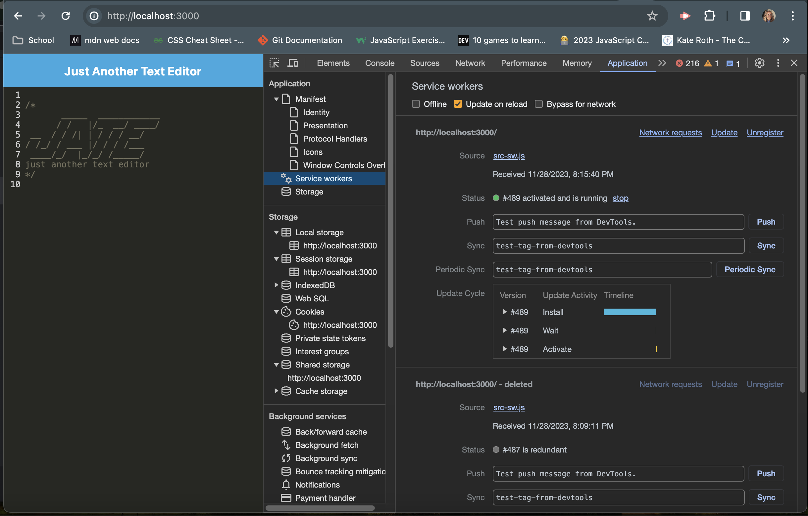
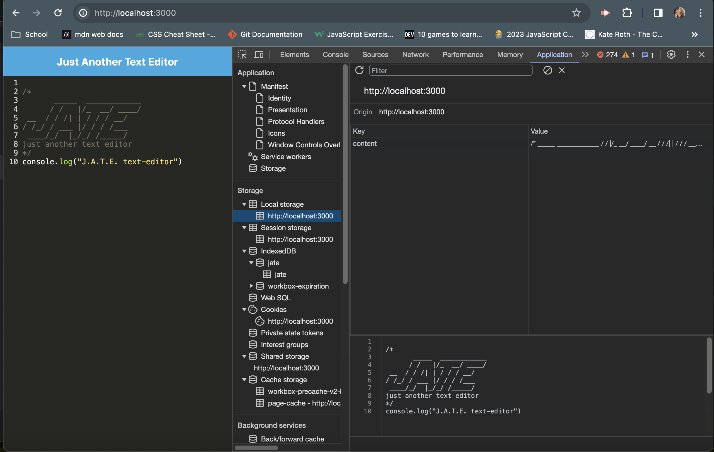

# PWA Text Editor

## Description

A project to configure and update a website to utilize a functional PWA.

## Table of Contents

-[PWA](#pwa)
-[Website Links](#websitelinks)
-[Credits](#credits)

  
## PWA Screenshots

## Website Links

Github https://github.com/thompsonholly/pwatexteditor

Heroku https://hw-jate-9d7092326c60.herokuapp.com/

## Credits

Created by Holly Thompson, a student attending the University of Minnesota Bootcamp. Gary Almes, U of MN instructor, provided starter code to give additional help for this project.

